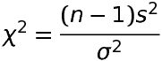

# 概要

母集団が母分散σ^2の正規分布に従うとき

抽出されたサンプルサイズをn

不偏分散をs^2とすると

次の公式で表されるχ^2が自由度n-1のカイ二乗分布に従うことを利用して母分散の信頼区間を計算する

# 公式



```
\chi^2 = \frac{(n-1)s^2}{\sigma^2}
```

# 例

2015年12月末時点の各都道府県内にある映画館のスクリーンの合計数のデータから無作為に10都道府県のデータを抽出した

このデータから母分散の95%信頼区間を求める

|No|都道府県|全スクリーン数|
|---|---|---|
|1|兵庫|126|
|2|大阪|224|
|3|奈良|34|
|4|岩手|25|
|5|千葉|199|
|6|茨城|89|
|7|福岡|178|
|8|山梨|14|
|9|滋賀|38|
|10|鳥取|11|

```py
from statistics import mean, variance

data = [126, 224, 34, 25, 199, 89, 178, 14, 38, 11]

# 標本の不偏分散を求める
v = variance(data)
```

結果

```
6757.288888888888
```


サンプルサイズは10なので自由度が10-1=9のカイ二乗分布を利用する

**カイ二乗分布は左右対称ではないので上側2.5%点と下側2.5%点をそれぞれ読み取る必要がある**

```
// 上側2.5%点
χ_0.025^2 (9) = 19.02

// 下側2.5%点
χ_0.975^2 (9) = 2.70
```

95%信頼区間を求めると

```
2.70 ≤ ((n-1) * s^2) / σ^2 ≤ 19.02

// 分母と分子を入れ替える
// このとき不等号が逆転する
1 / 2.70 ≥ σ^2 / ((n-1) * s^2) ≥ 1 / 19.02

// 見やすくするため不等号の向きを全て逆向きに戻す
1 / 19.02 ≤ σ^2 / ((n-1) * s^2) ≤ 1 / 2.70

// ((n-1) * s^2)をかける
((n-1) * s^2) / 19.02 ≤ σ^2 ≤ ((n-1) * s^2) / 2.70

// この式に合計スクリーン数のデータを当てはめる
(9 * 6757.28) / 19.02 ≤ σ^2 ≤ (9 * 6757.28) / 2.70

‭60815.52‬ / 19.02 ≤ σ^2 ≤ ‭60815.52‬ / 2.70

3197.451104100946 ≤ σ^2 ≤ 22524.26666666667‬
```

母分散は100回に95回の割合で `3197.45 ≤ σ^2 ≤ 22524.26` の範囲に含まれる

---

参考

[22-3. 母分散の信頼区間の求め方1 | 統計学の時間 | 統計WEB](https://bellcurve.jp/statistics/course/9212.html)
